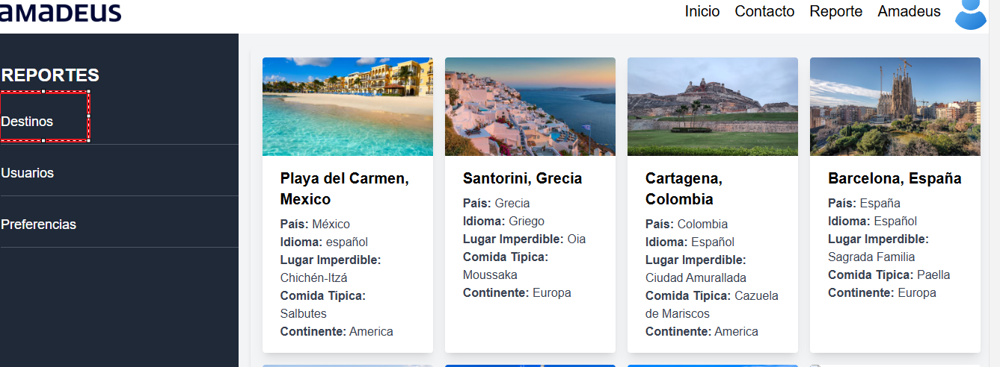

# back-amadeus-grupo7


## Índice
1. [Descripción](#descripción)
2. [Diseño ERD](#diseño-erd)
3. [Instalación](#instalación)
4. [Configuraciones](#configuraciones)
5. [Configuración de Base de Datos query](#Configuración-de-Base-de-Datos-query)
6. [Ejecución de Aplicación](#ejecución-de-aplicación)
7. [Ubicación enlace Swagger Documentación](#Ubicación-enlace-swagger-documentación)
8. [Tratamiento Error Base de Datos](#Tratamiento-Error-Base-de-Datos)
9. [Endpoints, Enlace y Documentación](#Endpoints-Enlace-y-Documentación)
10. [Reportes](#Reportes)
11. [Autores](#autores)


## Descripción

El proyecto cuenta inicialmente con datos almacenados en la Base de Datos relacionados con **preferencias** y **destinos**, los cuales están vinculados mediante una relación adscrita (matriz). La funcionalidad principal del proyecto es tomar información del usuario, como su **nombre** y **correo electrónico**, para luego asociarla con una respuesta basada en las preferencias existentes en la matriz. Si la preferencia no existe, el sistema la creará automáticamente y la asociará directamente con la respuesta **Bora Bora**.

Esto permite analizar cuáles opciones llevaron más frecuentemente a Bora Bora, con el objetivo de implementarlas posteriormente en preguntas predeterminadas o identificar destinos más adecuados según esas preferencias.

### Ventajas del Proyecto:
1. **Optimización de Búsquedas**:
   - Al almacenar toda la información de preferencias en la Base de Datos, los servicios de búsqueda son más rápidos. No es necesario procesar y mapear datos con lógica, ya que las búsquedas directas en la Base de Datos entre la tabla de preferencias y destinos ofrecen una respuesta inmediata.

2. **Gestión de Imágenes**:
   - El proyecto no guarda ni envía imágenes de destinos. En su lugar, accede a un servidor externo (por ejemplo, Google), lo que mejora significativamente el rendimiento del servicio.

3. **Documentación**:
   - Toda la documentación del proyecto está implementada en **Swagger UI**, facilitando la consulta y prueba de los endpoints disponibles.

Este enfoque optimiza tiempos de respuesta y ofrece un sistema eficiente para analizar preferencias y proponer destinos de forma dinámica y personalizada.

## Diseño ERD 
 
Ilustración 1. ERD de la DB

## Instalación

Para instalar las dependencias necesarias y configurar el proyecto, sigue estos pasos:

1. Descarga la aplicación desde el repositorio.
2. Asegúrate de estar dentro de la carpeta raíz del proyecto.
3. Ejecuta el siguiente comando para instalar las dependencias:

   ```bash
   ./gradlew build


Ilustración 2 Comando Instalación de Dependencias 

Este comando instalará todas las dependencias especificadas en el archivo build.gradle. Estas dependencias incluyen:

Swagger: Utilizada como herramienta de documentación y pruebas de los endpoints.
MapStruct: Empleada para gestionar los mapeos entre entidades y DTOs de manera eficiente.
Una vez completado este proceso, el proyecto estará listo para continuar con las configuraciones y ejecución.


Ilustración 3 Todas las dependencias 

## Configuraciones
Una vez que hayas instalado lo mencionado previamente, debes proceder con la configuración del archivo application.yml que se encuentra en la carpeta resources. En este archivo se definen las configuraciones necesarias para la aplicación.

Pasos de Configuración
Crear la Base de Datos (DB)
Dirígete a tu base de datos (DB) y crea una nueva base de datos con el nombre que hayas seleccionado. Este nombre será utilizado en las configuraciones de conexión en el archivo application.yml.

Configurar el archivo application.yml
Dentro del archivo application.yml, en la sección de datasource, debes especificar el nombre de la base de datos que has creado. En este ejemplo, se usará el nombre de la base de datos "Amadeus".

Conexión a la DB
Además de definir el nombre de la base de datos, también deberás proporcionar los datos de conexión, tales como el username y el password que uses en tu entorno local de pgAdmin.

Ejemplo de Configuración
A continuación se muestra un ejemplo de cómo se debe configurar el archivo application.yml:

datasource:
url: jdbc:postgresql://localhost:5432/Amadeus
username: tu_usuario
password: tu_contraseña

Ilustraciones


Ilustración 4: Ubicación del archivo application.yml.


Ilustración 5: Datos de la conexión con la DB.

## Configuración de Base de Datos query
Una vez que hayas completado las configuraciones previas, debes proceder con la ejecución de los comandos contenidos en el archivo query.sql. Estos comandos llenarán las tablas maestras y asociarán los destinos con las preferencias.

Pasos para Ejecutar el Archivo query.sql
Acceder al archivo query.sql
Dirígete al archivo query.sql y copia los comandos de cada sección. Es importante que los ejecutes en el orden correspondiente en pgAdmin.


Ilustración 6: Ubicación archivo query.sql

Ejecución en pgAdmin
Tienes dos opciones para ejecutar los comandos:

Opción 1: Copiar y pegar los comandos directamente en pgAdmin para ejecutarlos.
Opción 2: Ejecutar los comandos directamente desde la terminal.
Secciones del Archivo query.sql
A continuación, te mostramos las diferentes secciones que deberás ejecutar:

Sección Continentes
La sección de continentes debe tomarse completa y pasarse completa para ser ejecutada.


Ilustración 7: Sección Continentes

Sección Destinos
La sección de destinos también debe tomarse completa. Si es necesario, puedes ejecutar los destinos por defecto en un solo bloque con el comando COPY.


Ilustración 8: Sección Destinos


Ilustración 9: Sección Destinos por Default

Sección Preferencias
La sección de preferencias debe tomarse en su totalidad y ejecutarse de una vez (copia y pega).


Ilustración 10: Sección de Preferencias

Llenado de Tablas de Relación
Después de ejecutar los comandos anteriores, deberás llenar las tablas de relación de Preferencias y Destinos. Para evitar errores durante la ejecución, sigue estos pasos:

Ejecución en grupos pequeños: Llena las tablas en grupos de tres comandos a la vez. Esto ayuda a mantener el control y evitar errores. Asegúrate de reemplazar los comandos ejecutados por los siguientes tres que se vayan a ejecutar.


Ilustración 11: Preferencias y Destinos

 ## Ejecución de Aplicación
Una vez que hayas completado las configuraciones previas y ejecutado los comandos necesarios en la base de datos, es momento de ejecutar la aplicación.

Pasos para Ejecutar la Aplicación
Ejecutar desde el archivo AmadeusApplication
Para ejecutar la aplicación, haz clic derecho sobre el archivo AmadeusApplication. Dependiendo del entorno de desarrollo que utilices, las opciones serán las siguientes:

Si estás usando Visual Studio Code, aparecerá la opción Run JAVA.
Si estás usando IntelliJ IDEA, aparecerá la opción Run 'AmadeusApplication.main()'.


Ilustración 12: Ubicación para ejecutar o correr el proyecto

Si no aparecen las opciones anteriores
Si no ves las opciones mencionadas, ingresa al archivo AmadeusApplication. Justo encima del archivo, verás un triángulo apuntando hacia la derecha. Al hacer clic en este triángulo, podrás ejecutar la aplicación.


Ilustración 13: Ubicación archivo para ejecutar


Ilustración 14: Ubicación lugar para correr el proyecto


 ## Ubicación enlace Swagger Documentación
Al realizar los pasos anteriores y ejecutar la aplicación correctamente, podrás acceder a la documentación de la API a través de Swagger utilizando el siguiente enlace:

http://localhost:8084/api/v1/swagger-ui/index.html

Este enlace se encuentra configurado en el archivo application.yml.


Ilustración 15: Ubicación enlace Swagger


## Tratamiento Error Base de Datos

En caso de existir algún error al intentar pasar los datos a la base de datos mediante el archivo `query.sql`, se debe realizar un cambio en el archivo `application.yml`.

### Pasos a seguir:

1. **Modificar el archivo `application.yml`**:
   - Cambiar el valor de `update` por `create-drop`.

2. **Ejecutar la aplicación**:
   - Si la aplicación no está ejecutándose, ejecutarla.
   - Si la aplicación ya está en ejecución, esperar a que se recargue la consola de la aplicación mostrando los nuevos cambios.

### ¿Qué hace el comando `create-drop`?

El comando `create-drop` vacía el contenido de todas las tablas de la base de datos. Solo se conserva la estructura de la base de datos (tablas y columnas).


### Ilustración 16: Ubicación del cambio de comando

*Borra los datos*


### Ilustración 17: Ubicación del cambio de comando

Una vez verificada la eliminación de los datos, se debe regresar el cambio a `update` para que los nuevos datos sean guardados correctamente. 

**Nota**: Si no se regresa el cambio a `update`, la aplicación estará constantemente eliminando todo el ingreso de datos.


## Endpoints, Enlace y Documentación

Accede al siguiente enlace para utilizar Swagger, el cual contiene tres diferentes **Endpoints**:

[Swagger UI](http://localhost:8084/api/v1/swagger-ui/index.html)

Los tres Endpoints disponibles son:

1. **Endpoints Usuario Controller**
2. **Preferencia-Controller**
3. **Endpoints Destino Controller**


### Ilustración 18: Endpoints en el enlace de Swagger

#### 1. Usuario Controller
En el **Usuario Controller**, se encuentran varios Endpoints, algunos de los cuales actualmente no se usarán en la aplicación del Frontend, como el `POST /usuarios`.


- **GET /usuarios**: Sirve para buscar usuarios.
  

  
  ### Ilustración 19: Buscar Usuarios

- **POST /usuarios**: Sirve para crear un nuevo usuario.
  

  
  ### Ilustración 20: Crear Usuario

#### 2. Preferencia Controller
En el **Preferencia Controller**, se encuentran los Endpoints relacionados con las preferencias que el usuario selecciona, tales como el **email** y **nombre de usuario**. Estas preferencias se utilizarán internamente en el Backend de la misma forma que en el `POST /usuarios`.

- **POST /preferencias**: Al llenarlo, devolverá un **status OK** y mostrará los destinos seleccionados según las preferencias del usuario.
  

  
  ### Ilustración 21: Consulta los destinos según las Preferencias


  
  ### Ilustración 22: Estatus OK e información

- **GET /preferencias/usuario/{email}**: Utilizado para tomar las preferencias de un solo usuario, validando el email, que es único en la base de datos. Al ingresar el email, buscará los destinos recomendados para esa persona.
  

  
  ### Ilustración 23: Consulta las preferencias del usuario

  
  ### Ilustración 24: Estatus OK e información

#### 3. Destino Controller
En los **Endpoints de Destino Controller**, se pueden crear o consultar destinos.

- **GET /destinos**: Trae todos los destinos que existen en la base de datos, incluyendo los destinos por defecto como **Bora Bora** y **Dubái**.
  

  
  ### Ilustración 25: Consulta todos los Destinos

- **POST /destino**: Permite crear un nuevo destino, ingresando el nombre y el continente ID, que se validará posteriormente.
  
  
  ### Ilustración 26: Crear un Destino

  
  ### Ilustración 27: Estatus OK e información

- **GET /destinos/ids**: Permite consultar los destinos por sus IDs, a través de un array, y devolverá los destinos correspondientes.
  

  
  ### Ilustración 28: Consulta Destinos por IDs

  
  ### Ilustración 29: Estatus OK e información


## Reportes

Los reportes traen la información relacionada con tres partes principales:

1. **Destinos**
2. **Usuarios**
3. **Preferencias**


### Ilustración 30: Sección de Reportes

#### 1. Destinos
Para la sección de destinos, utilizamos el endpoint **GET /destinos**, el cual obtiene todos los destinos disponibles.

- **Endpoint**: `GET /destinos`
  
  [Acceder a los destinos](http://localhost:8084/api/v1/destinos)

  
  ### Ilustración 31: Sección Destinos

#### 2. Usuarios
Para la sección de usuarios, utilizamos el endpoint **GET /usuarios**, el cual obtiene todos los usuarios registrados.

- **Endpoint**: `GET /usuarios`
  
  [Acceder a los usuarios](http://localhost:8084/api/v1/usuarios)


  
  ### Ilustración 32: Sección Usuarios

#### 3. Preferencias
Para la sección de preferencias, utilizamos el endpoint **GET /preferencias**, el cual obtiene todas las preferencias. Estas preferencias están relacionadas con los destinos seleccionados por los usuarios.

- **Endpoint**: `GET /preferencias`
  
  [Acceder a las preferencias](http://localhost:8084/api/v1/preferencias)


  ### Ilustración 33: Sección de Preferencias


## Autores 

Colaboradores que hicieron posible este proyecto:

- **Alvaro Toro Martinez**  
  Email: [torom.alvaro@gmail.com](mailto:torom.alvaro@gmail.com)

- **Yasmin Sirley Ospina Bran**  
  Email: [sirleyob244@gmail.com](mailto:sirleyob244@gmail.com)
